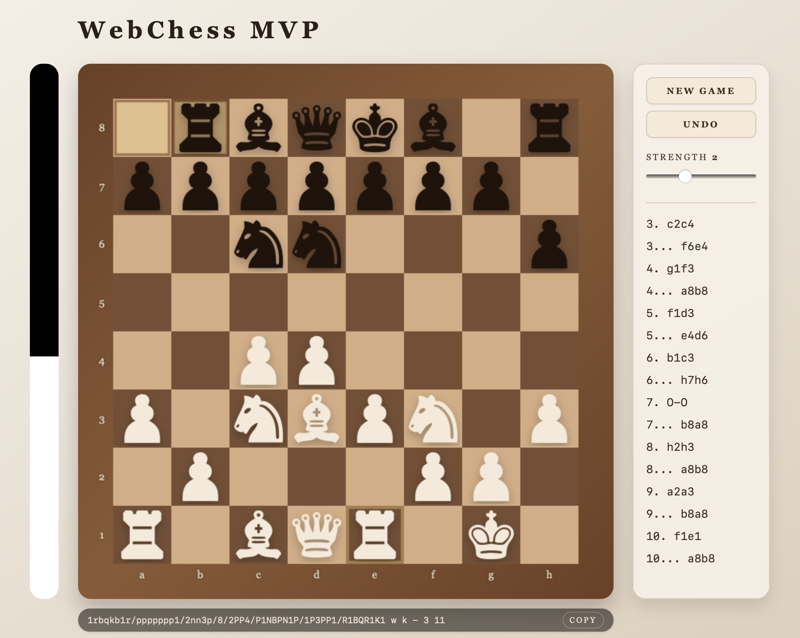

# WebChess MVP

Single-page chess app with a Python backend and a canvas-based UI. The server validates moves, returns notation and FEN, and provides a simple engine for black moves and analysis.



## Quickstart (Docker)

```bash
./buildenv.sh init
./buildenv.sh start
```

Open: http://127.0.0.1:8000

## Features
- Canvas-rendered board with textured tiles and piece sprites
- Drag-and-drop moves with animated snapping
- Live move validation with legal/illegal feedback
- Rules engine with castling, en passant, and promotion (auto-queen)
- Move list and FEN panel synced after each move
- Automatic black moves via a built-in engine (depth slider 1-4)
- Game-over detection (checkmate / stalemate) surfaced in responses
- Tailwind CSS loaded via CDN (no build step)

## API Overview

Endpoints:
- `GET /api/health` health check
- `POST /api/fen` return FEN for a given board/state
- `POST /api/validate` validate and apply a move
- `POST /api/move` return an engine move with analysis metadata
- `POST /api/win-probability` return win probabilities with analysis metadata

### Coordinate and board conventions

- `file`: `0..7` corresponds to `a..h`
- `rank`: `0..7` corresponds to `8..1` (rank 0 is the top of the board)
- `board` is an 8x8 matrix indexed as `board[rank][file]`
- piece codes: uppercase = white (`"P"`), lowercase = black (`"p"`)
- `turn` is `"white"` or `"black"`

### `POST /api/validate`

Request shape (minimal example):

```json
{
  "board": [["r","n","b","q","k","b","n","r"], ["p","p","p","p","p","p","p","p"], [null,null,null,null,null,null,null,null], [null,null,null,null,null,null,null,null], [null,null,null,null,null,null,null,null], [null,null,null,null,null,null,null,null], ["P","P","P","P","P","P","P","P"], ["R","N","B","Q","K","B","N","R"]],
  "turn": "white",
  "castling": "KQkq",
  "en_passant": null,
  "halfmove": 0,
  "fullmove": 1,
  "move": {"from": {"file": 4, "rank": 6}, "to": {"file": 4, "rank": 4}}
}
```

Response highlights:
- `legal` + `reason` (stable reason codes like `no_piece`, `wrong_color`, `occupied_by_ally`, `king_in_check`, ...)
- `notation` (LAN, e.g. `e2e4`, castling as `O-O` / `O-O-O`)
- `fen` (next-turn position)
- state updates: `castling`, `en_passant`, `halfmove`, `fullmove`
- capture/castle/promotion metadata when applicable
- game end: `game_over`, `outcome` (`checkmate|stalemate`), `winner`

### `POST /api/move`

Request matches the game state payload and accepts an optional `depth` (1-4). The response includes:
- `move` in UCI format (e.g. `e2e4`)
- `from`/`to` coordinates
- analysis metadata: `depth`, `nodes`, `score`

### `POST /api/win-probability`

Request matches the game state payload and accepts an optional `depth` (1-4). The response includes:
- `white` and `black` win probabilities that sum to 1.0
- analysis metadata: `depth`, `nodes`, `score`

## Running tests

```bash
./buildenv.sh test
```

Deterministic seed (optional):

```bash
PYTEST_DETERMINISTIC_SEED=42 ./buildenv.sh test
```

## VS Code tasks

Tasks live in `.vscode/tasks.json`:
- `Init Docker Image`
- `Docker Bash`
- `Run Tests`
- `Start Uvicorn`
- `Stop Uvicorn`

## Project structure
- `app/chess/` rules, notation, and engine
- `app/api/` API routes and schemas
- `app/static/` frontend assets (HTML/CSS/JS + piece SVGs)
- `tests/` pytest test suite
